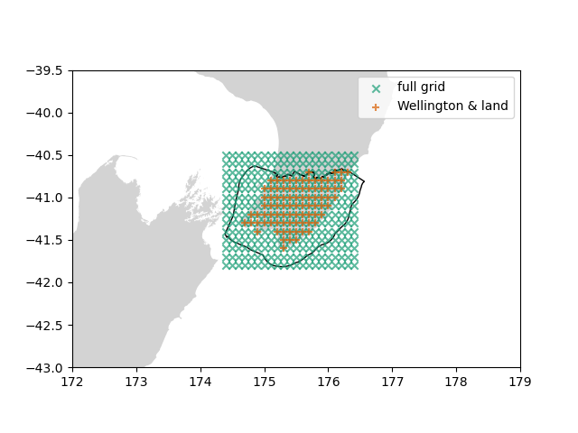

# NZ geometries

Provides geospatial geometries describing New Zealand coastlines and regional administrative boundaries.



## Installation 

```
pip install nzgeom
```
or

```
conda install -c conda-forge nzgeom
```

## Documentation and Usage Examples

Please see nzgeom's documentation and usage examples at [ReadTheDocs](https://nz-geometries.readthedocs.io/en/latest/index.html#/).

## Credits

The [Regional Council boundary data](https://datafinder.stats.govt.nz/layer/92204-regional-council-2018-generalised/) are provided by [Stats NZ Tatauranga Aotearoa](https://stats.govt.nz/) under the terms of the [Creative Commons Attribution 4.0 International](https://datafinder.stats.govt.nz/license/attribution-4-0-international/).

The [NZ coastlines data](https://data.linz.govt.nz/layer/50258-nz-coastlines-topo-150k/) are provided by [Toitū Te Whenua Land Information New Zealand](https://www.linz.govt.nz/) under the terms of the [Creative Commons Attribution 4.0 International](https://datafinder.stats.govt.nz/license/attribution-4-0-international/).
