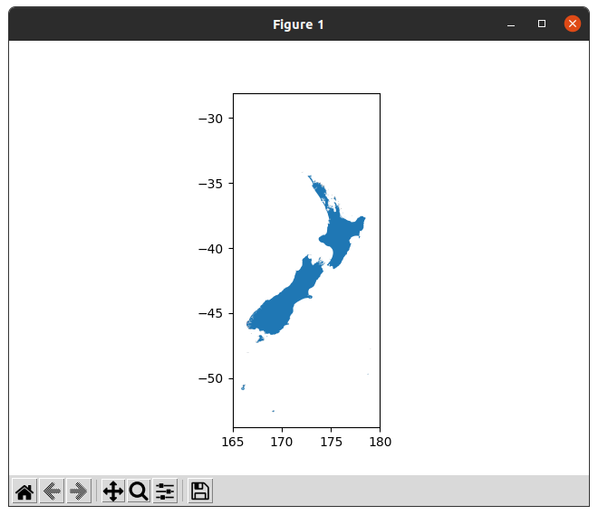

# NZ geometries

Provides geospatial geometries describing New Zealand coastlines and regional administrative boundaries.

## Installation 

Work in progress.

## Usage Examples

``` python
>>> import nzgeom.coastlines
>>> c =  nzgeom.coastlines.get_NZ_coastlines()
>>> c
                               name macronated  ...                     name_ascii                                           geometry
0                              None          N  ...                           None  MULTIPOLYGON (((175.76343 -36.43109, 175.76327...
1                              None          N  ...                           None  MULTIPOLYGON (((175.76337 -36.43096, 175.76312...
2                              None          N  ...                           None  MULTIPOLYGON (((168.14925 -47.11982, 168.14868...
3                              None          N  ...                           None  MULTIPOLYGON (((166.90386 -46.58083, 166.90376...
4                         Lion Rock          N  ...                      Lion Rock  MULTIPOLYGON (((175.75020 -36.77198, 175.74985...
...                             ...        ...  ...                            ...                                                ...
9134  Tāhuahua-Paopao-Karoro Island          Y  ...  Tahuahua-Paopao-Karoro Island  MULTIPOLYGON (((173.28982 -34.90622, 173.29034...
9135              Wakatehāua Island          Y  ...              Wakatehaua Island  MULTIPOLYGON (((172.89280 -34.68681, 172.89304...
9136               Ōhau/West Island          Y  ...               Ohau/West Island  MULTIPOLYGON (((172.03345 -34.18387, 172.03354...
9137     Manawatāwhi / Great Island          Y  ...     Manawatawhi / Great Island  MULTIPOLYGON (((172.14683 -34.14436, 172.14729...
9138  North Island or Te Ika-a-Māui          Y  ...  North Island or Te Ika-a-Maui  MULTIPOLYGON (((175.13516 -41.37745, 175.13507...
```
If matplotlib is available, it's easy to plot the coastline geodataframe (or add the coastlines to an existing plot):

``` python
>>> import matplotlib.pyplot as plt
>>> ax = c.plot
>>> ax.set_xlim([165, 180])
>>> plt.show()
```


For the council region boundaries:
``` python
>>> import nzgeom.regions
>>> r = nzgeom.regions.NZRegions()
>>> r.list_regions()
        Northland Region
         Auckland Region
          Waikato Region
    Bay of Plenty Region
         Gisborne Region
      Hawke's Bay Region
         Taranaki Region
Manawatu-Wanganui Region
       Wellington Region
       West Coast Region
       Canterbury Region
            Otago Region
        Southland Region
           Tasman Region
           Nelson Region
      Marlborough Region
     Area Outside Region
>>> r.get_region_geodataframe("Auckland Region")
  REGC2018_V1_00 REGC2018_V1_00_NAME  LAND_AREA_SQ_KM    AREA_SQ_KM   Shape_Length                                           geometry
1             02     Auckland Region      4941.572557  16156.610062  659677.328124  MULTIPOLYGON (((1788533.265 6047342.800, 17891...

```

## Credits

The [Regional Council boundary data](https://datafinder.stats.govt.nz/layer/92204-regional-council-2018-generalised/) are provided by [Stats NZ Tatauranga Aotearoa](https://stats.govt.nz/) under the terms of the [Creative Commons Attribution 4.0 International](https://datafinder.stats.govt.nz/license/attribution-4-0-international/).

The [NZ coastlines data](https://data.linz.govt.nz/layer/50258-nz-coastlines-topo-150k/) are provided by [Toitū Te Whenua Land Information New Zealand](https://www.linz.govt.nz/) under the terms of the [Creative Commons Attribution 4.0 International](https://datafinder.stats.govt.nz/license/attribution-4-0-international/).
